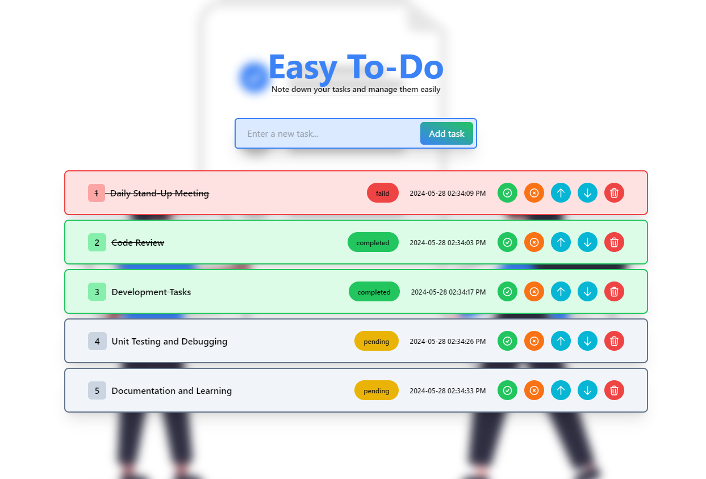

# Easy To-Do

## Overview
**Easy To-Do** is a simple yet powerful to-do list application built using React. It allows users to add, manage, and track their tasks with ease. The application supports functionalities like adding tasks, marking them as completed, or failed, deleting tasks, and reordering tasks through drag and drop. The tasks are stored using browser cookies, ensuring persistence across sessions

## Tech Stack
- **Frontend:** React
- **Development Environment:** Vite
- **Styling:** Tailwind CSS
- **Assets:** SVG Images, Custom Icons
- **Persistence:** Cookies

## Features
- **Add Tasks:** Users can add new tasks to their to-do list.
- **Mark as Completed:** Users can mark tasks as completed.
- **Mark as Failed:** Users can mark tasks as failed.
- **Delete Tasks:** Users can delete tasks from the list.
- **Reorder Tasks:** Users can move tasks up and down the list using drag and drop.
- **Persistent Storage:** The to-do list is stored in cookies for persistent storage.

## Installation
1. Clone the repository:
    ```bash
    git clone https://github.com/darshana-wishwajith/react-todo.git
    ```
2. Navigate to the project directory:
    ```bash
    cd react-todo
    ```
3. Install the dependencies:
    ```bash
    npm install
    ```
4. Start the development server:
    ```bash
    npm run dev
    ```

## Usage
1. Open your browser and navigate to `http://localhost:5173`.
2. Use the input field to add a new task.
3. Click the "Add task" button to add the task to your list.
4. Use the provided buttons to mark tasks as completed, failed, or to delete them.
5. Drag and drop tasks to reorder them.

## Components

### `App`
This is the main component that renders the `ToDo` component.

### `ToDo`
This component handles the main functionality of the application:
- Manages the state for the to-do list.
- Handles adding, deleting, completing, failing, and reordering tasks.
- Persists the to-do list in cookies.

### `ToDoListItem`
This component renders individual to-do items and provides buttons for task actions.

## Screenshots

*Description: Screenshot of the interface where users can add new tasks.*

## License
This project is licensed under the MIT License. See the [LICENSE](LICENSE) file for details.

## Contributing
Contributions are welcome! Please open an issue or submit a pull request for any changes.

## Contact
For any inquiries, please contact [darshanawishwajith494@gmail.com](mailto:your-email@example.com).

---
